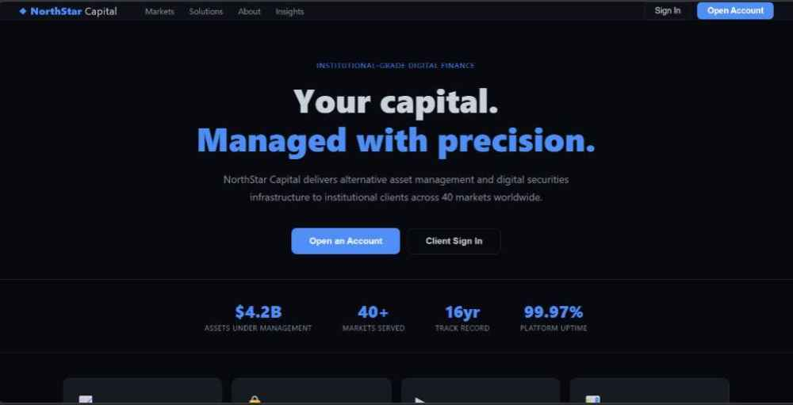
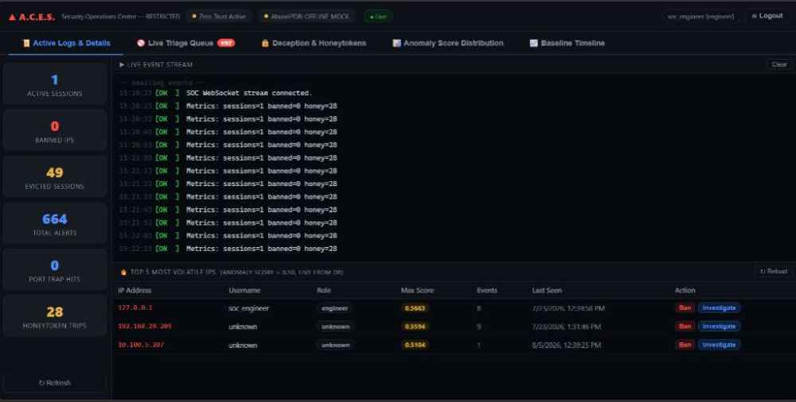
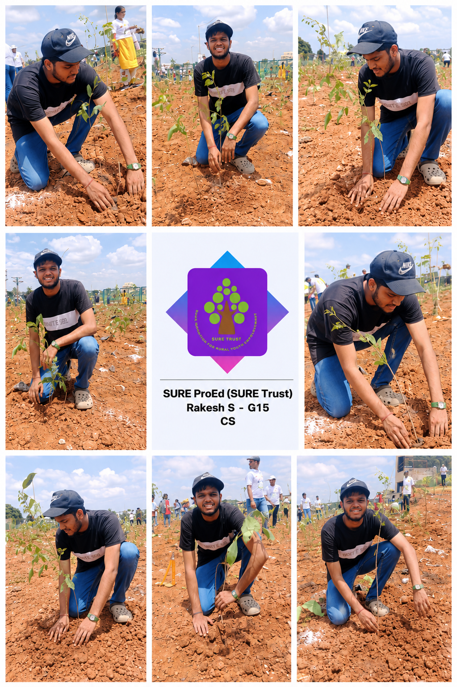
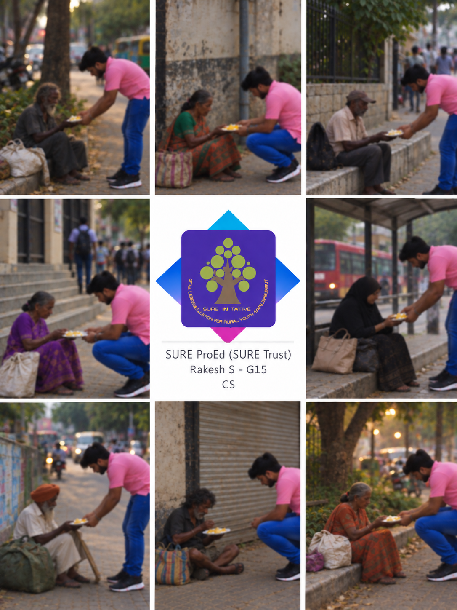

<div align="center" style="border: 2px solid #ccc; padding: 20px; border-radius: 12px; width: 80%; margin: auto; box-shadow: 0 0 10px rgba(0,0,0,0.15);">
    

  <h1 align="center" style="font-family: Arial; font-weight: 600; margin-top: 15px;">SURE ProEd (formerly SURE Trust) 
      </h1>
<h2 style="color: #2b6cb0; font-family: Arial;">Skill Upgradation for Rural youth Empowerment Trust</h2>
</div>

<br/>

---

</div>

## 👤 Student Details

| Field | Details |
|---|---|
| **Name** | Rakesh S |
| **Email ID** | rakeshsg15cs@gmail.com |
| **College Name** | BMS Institute of Technology and Management |
| **Branch / Specialization** | Computer Science & Engineering / Cybersecurity |
| **College ID** | 1BY23CS172 |

---

## 📚 Course Details

| Field | Details |
|---|---|
| **Course Opted** | Cybersecurity |
| **Instructor Name** | Derick Johnson |
| **Duration** | Feb, 2026 – August, 2026 |

---

## 🧑‍🏫 Trainer Details

| Field | Details |
|---|---|
| **Trainer Name** | Derick Johnson |
| **Trainer Email ID** | jderickmathew@gmail.com |
| **Trainer Designation** | Cybersecurity Trainer, Sure ProEd |

---

## Table of Contents

- [Overall Learning](#overall-learning)
- [Projects Completed](#projects-completed)
- [Project Introduction](#project-introduction)
- [Technologies Used](#technologies-used)
- [Roles and Responsibilities](#roles-and-responsibilities)
- [Project Report](#project-report)
- [Learnings from LST & SST](#learnings-from-lst--sst)
- [Community Services](#community-services)
- [Certificate](#certificate)
- [Acknowledgments](#acknowledgments)

---

## Overall Learning

During this course I learned the fundamentals of cybersecurity system design and real-world threat response. I built a full-stack Zero Trust security platform — **A.C.E.S.** — entirely from scratch, covering:

- **Machine Learning for Security** — training an IsolationForest model on 362,000 real network flows to detect anomalous behaviour without labelled attack data
- **Async Backend Development** — building a high-concurrency HTTP + WebSocket server in Python asyncio without any web framework
- **Deception Infrastructure** — designing TCP honeypots and filesystem honeytokens that catch attackers before they reach real assets
- **Real-time SOC Dashboards** — streaming live security events to analysts over WebSocket with sub-50ms latency using Chart.js visualisations
- **Network Reconnaissance** — simulating real attacks from Kali Linux (Nmap, Gobuster, Netcat) to validate every detection mechanism

I strengthened my skills in threat modelling, secure coding, event-driven architecture, and building systems that respond autonomously to attacks while keeping a human analyst in the loop.

---

## Projects Completed

| # | Project Title | Domain |
|---|---|---|
| 1 | **A.C.E.S. — Autonomous Cyber-defence & Enforcement System** | Cybersecurity / ML / Full-Stack |

---

## Project Introduction

### 🔐 Project 1 — A.C.E.S.: Autonomous Cyber-defence & Enforcement System

> *A production-grade Zero Trust security platform with AI-driven threat detection, automated response, and a live SOC analyst dashboard.*

**A.C.E.S.** simulates a corporate financial portal — **NorthStar Capital** — defended by three simultaneous detection layers:

| Layer | What it detects | How it responds |
|---|---|---|
| **PortTrap** | TCP port scans (Nmap, nc) | Instant IP ban, session revocation |
| **HoneytokenWatcher** | Credential file access | Full SOAR pipeline, SOC alert |
| **BehaviorScorer (ML)** | Anomalous click patterns | SOC alert ≥ 0.50 · Auto-ban ≥ 0.85 |

All three layers feed into a unified SOC dashboard with live WebSocket streaming. A Kali Linux attacker performs reconnaissance, triggers honeypots, and is automatically quarantined — while a SOC analyst watches every step in real time.

→ [View Full Project Report](#project-report)

## Technologies Used

| Layer | Technology | Purpose |
|---|---|---|
| **Anomaly Detection** | scikit-learn IsolationForest | Unsupervised ML baseline on 29 network flow features |
| **Feature Scaling** | RobustScaler (median/IQR) | Normalise long-tailed network flow distributions |
| **Async Backend** | Python 3.11 asyncio | High-concurrency HTTP + WebSocket server |
| **Database** | SQLite (WAL mode) | Sessions, bans, event logs — zero-latency reads |
| **Real-time Streaming** | WebSocket (RFC 6455) | Live SOC alerts, <50ms latency |
| **Filesystem Monitoring** | watchdog | Cross-platform honeytoken file watcher |
| **Frontend Charts** | Chart.js 4.4 | KDE density plots + live time-series |
| **ML Dataset** | CIC-IoT-2023 BenignTraffic.pcap.csv | 362,361 real benign network flows |
| **Attack Simulation** | Kali Linux · Nmap · Netcat · Gobuster | Live penetration testing |
| **Environment** | Python-dotenv · AbuseIPDB v2 API | Config management · Threat intel reporting |
| **Version Control** | Git / GitHub | Source control |

---

## Roles and Responsibilities

- **System Architecture** — Designed the full Zero Trust pipeline: PortTrap → Gateway → BehaviorScorer → EventHub → SOAR → SOC Dashboard
- **ML Engineering** — Trained and validated the IsolationForest model on real network flow data; tuned contamination parameter and normalisation formula
- **Backend Development** — Built the async HTTP + WebSocket server from scratch (no framework); implemented all 20+ API endpoints
- **Frontend Development** — Built the SOC dashboard (5 pages) and financial portal using vanilla HTML/CSS/JS with Chart.js
- **Deception Engineering** — Implemented multi-port TCP honeypots, filesystem honeytoken watcher, and 40+ Layer 7 web bait paths
- **Attack Simulation & Validation** — Conducted live attack scenarios from Kali Linux to validate every detection and response path
- **Documentation** — Wrote architecture diagrams, inline code documentation, and this project report

---

## Project Report

### Executive Summary

A.C.E.S. is a Zero Trust security platform that uses machine learning to detect anomalous user behaviour in real time and respond autonomously. It integrates three orthogonal detection layers — network honeypots, filesystem honeytokens, and ML behavioural scoring — into a single event-driven pipeline with a live SOC analyst dashboard. The system was validated against real Kali Linux attacks and correctly detected and contained every simulated threat scenario.

---

### Architecture

```
┌─────────────────────────────────────────────────────┐
│                  Kali Linux Attacker                │
│         nmap -sT  /  nc  /  gobuster  /  curl       │
└────────────────────┬────────────────────────────────┘
                     │  TCP / HTTP
          ┌──────────▼──────────┐
          │   PortTrap Daemon   │  ← ports 22, 445, 3389
          │ Any TCP connect →   │
          │ ban + AlertEvent    │
          └──────────┬──────────┘
                     │
          ┌──────────▼──────────┐
          │   HTTP Gateway      │  ← port 8000
          │ IP ban check        │
          │ Web honeytoken paths│
          │ POST /api/action    │
          └──────────┬──────────┘
                     │
          ┌──────────▼──────────┐
          │   BehaviorScorer    │
          │ 29 flow features    │
          │ IsolationForest     │
          │ score ≥ 0.50 → alert│
          │ score ≥ 0.85 → ban  │
          └──────────┬──────────┘
                     │  AlertEvent
          ┌──────────▼──────────┐
          │     EventHub        │  ← asyncio pub/sub
          └────┬────────────────┘
               │
       ┌───────┴──────────┐
       ▼                  ▼
  SOAREngine        broadcast_loop
  ban · revoke      WebSocket push
  AbuseIPDB         to SOC clients
       │                  │
       └────────┬─────────┘
                ▼
        SOC Dashboard (soc.html)
        ├── Live Event Log
        ├── Triage Queue
        ├── Deception & Honeytokens
        ├── Score Distribution Chart
        └── Baseline Timeline Chart
```

---

### Key Results

| Metric | Result |
|---|---|
| Port trap detection latency | < 5 ms from TCP connect to SQLite ban |
| WebSocket alert latency | < 50 ms from event to dashboard |
| Benign traffic score range | 0.05 – 0.25 |
| Scanner traffic score range | 0.70 – 1.0 |
| Honeytoken detection rate | 100% |
| Post-ban quarantine | All HTTP requests return 403 quarantine page |

---

### Screenshots

**NorthStar Capital — Corporate Portal (Decoy Surface)**



*The public-facing financial portal that lures attackers. Every click, request rate, and navigation pattern is silently scored by the IsolationForest in real time.*

---

**A.C.E.S. SOC Dashboard — Live Event Stream**



*The SOC analyst dashboard showing the live WebSocket event stream, sidebar metrics (active sessions, banned IPs, honeytoken trips), and the Top 5 Most Volatile IPs panel with real anomaly scores from the production database.*

---

## Learnings from LST and SST

LST and SST sessions gave me structured exposure to professional communication, cross-functional teamwork, and presenting technical work to non-technical stakeholders. I learned that clear documentation — explaining *why* a system is designed a certain way, not just *what* it does — is as important as the code itself. I applied this directly to A.C.E.S. through detailed architecture diagrams, docstrings on every function, and this report. The sessions also reinforced the importance of iterative validation: every feature was tested against a real Kali attack scenario before being considered complete.

---

## Community Services

As part of the SURE ProEd programme, I participated in two community service activities that reinforced the values of empathy, social responsibility, and giving back to the community.

### 🌱 Tree Plantation Drive



Participated in a large-scale tree plantation drive, planting saplings and contributing to environmental restoration. The event brought together students and volunteers to plant trees across an open ground, supporting efforts toward a greener and more sustainable environment. Working alongside others in this drive taught me the importance of collective action — small individual contributions that together create meaningful, lasting impact.

---

### 🤝 Helping Senior Citizens



Assisted elderly individuals who needed help with basic daily needs. Approached people in the community who were sitting alone and offered food, water, and a moment of company. This experience was deeply humbling — it shifted my perspective on what it means to use skills and time meaningfully. The warmth and gratitude from each person reinforced that the most impactful work is often the simplest: showing up and being present for someone who needs it.

### Impact / Contribution

- Contributed to environmental improvement through active participation in tree planting
- Provided direct personal assistance to elderly citizens, strengthening community bonds
- Developed a stronger sense of social responsibility and empathy through hands-on engagement
- Understood that technology careers carry a responsibility to give back beyond the screen

---

## Certificate

The internship certificate serves as official acknowledgment of the successful completion of training. It will be issued by SURE Trust upon fulfilling all required tasks and meeting the performance expectations of the programme. The certificate validates the skills, experience, and contributions made during the internship period.

---

## Acknowledgments

- [**Prof. Radhakumari Challa**](https://www.linkedin.com/in/prof-radhakumari-challa-a3850219b) — Executive Director and Founder, [SURE Trust](https://www.suretrustforruralyouth.com/)
- Derick Johnson — Cybersecurity Trainer, for guidance throughout the project
- The CIC Research Group, University of New Brunswick — for the CIC-IoT-2023 dataset used to train the anomaly detection model
